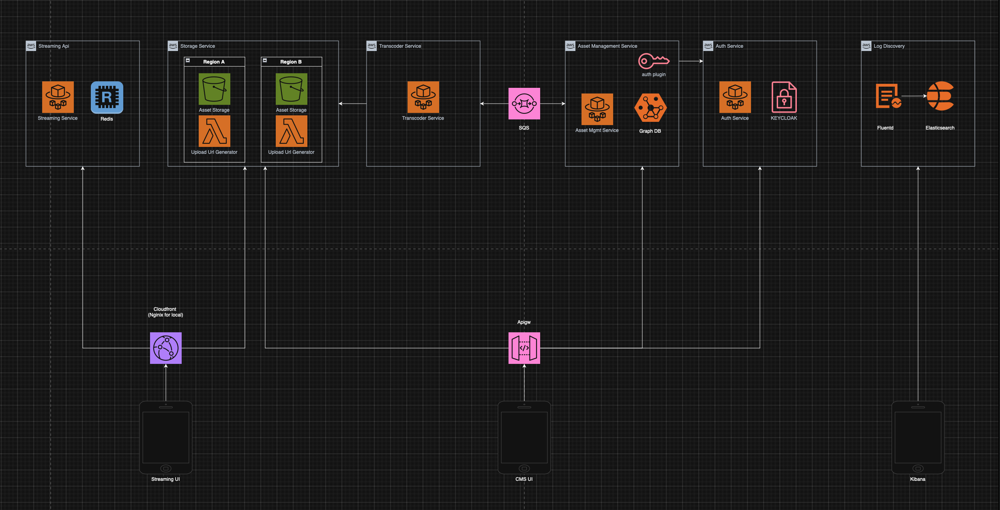

# Hobby Streamer

> A personal playfround for exploring video streaming ideas, testing asset management best practices, new technologies, and learning.

Hobby Streamer is my testing ground for video processing pipelines, asset management systems, domain-driven design patterns, and event-driven microservices. It's where I try out new ideas, test different architectural approaches, and experiment with various technologies. The platform handles video uploads, HLS and DASH transcoding, and streaming delivery while incorporating authentication (Keycloak), logging, monitoring, and developer tooling as I explore best practices.

## What's Here

Features include video upload, transcoding (HLS, DASH), stream delivery, asset metadata, Keycloak auth, Redis caching, Kafka event streaming, AWS Lambdas, circuit breakers, retries, health checks, and rate limiting.

Services: [`asset-manager`](backend/asset-manager/README.md), [`auth-service`](backend/auth-service/README.md), [`transcoder`](backend/transcoder/README.md), [`streaming-api`](backend/streaming-api/README.md), AWS Lambdas ([`raw_video_uploaded`](backend/lambdas/cmd/raw_video_uploaded/README.md), [`hls_job_requested`](backend/lambdas/cmd/hls_job_requested/README.md), [`dash_job_requested`](backend/lambdas/cmd/dash_job_requested/README.md), [`generate_video_upload_url`](backend/lambdas/cmd/generate_video_upload_url/README.md), [`generate_image_upload_url`](backend/lambdas/cmd/generate_image_upload_url/README.md), [`delete_files`](backend/lambdas/cmd/delete_files/README.md)), and React Native frontends ([`HobbyStreamerCMS`](frontend/HobbyStreamerCMS/README.md), [`HobbyStreamerUI`](frontend/HobbyStreamerUI/README.md)). Shared code lives under `backend/pkg`.

## Architecture



Docs: [CDN Proposal](docs/cdn-proposal.md), [Kafka Architecture](docs/kafka-architecture.md)

## Tech Stack

Go, GraphQL, Neo4j, Keycloak, FFmpeg, Redis, Kafka, Docker Compose, LocalStack, Fluentd, Elasticsearch, Kibana, Nginx, React Native, AWS Lambda.

## Quick Start

Requirements: Docker, Go 1.21+, FFmpeg, Python+pipx, Node.js 22+, awscli-local.

```
./local/build.sh
```

Starts the services, UIs, dependencies, and logging pipeline.

## Development

```
make backend-install-tools
make backend-lint 
make backend-test
make backend-generate backend-build
```

## Testing

Integration tests live in `integration-tests` and use Karate for end-to-end API workflows.

## Observability

See `local/LOGGING.md` for Fluentd → Elasticsearch → Kibana setup with structured logs and correlation IDs.

