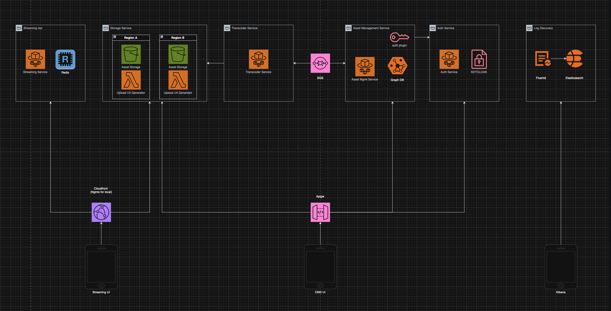

# Hobby Streamer

> Just a personal sandbox — not production, not polished.

This is a side project where I experiment with ideas for building a basic video streaming platform. It's mostly a place to tinker with Go, streaming pipelines, infrastructure tools, and architectural patterns. Nothing here is final or meant for serious use — just hacking around and learning along the way.

## What This Is

Hobby Streamer pieces together:
- Video upload and FFmpeg-based transcoding
- Stream delivery (HLS/DASH)
- Asset metadata and relationships
- Basic auth + role handling with Keycloak
- Developer-focused logging and monitoring setup

## Architecture



There’s also a [sequence diagram](docs/video-upload-transcode-sequence.md)

## Tech Stack (Today, at Least)

### Backend
- Go
- GraphQL 
- Neo4j 
- Keycloak (OAuth2, RBAC)
- FFmpeg (CLI MVP)
- Redis 

### Infra
- Docker Compose (for local dev)
- LocalStack (mock AWS: S3, SQS, Lambda)
- Fluentd + Elasticsearch + Kibana (log stack)
- Nginx (pretend CDN)

### Frontend
- React Native 
- Basic CMS and viewer UI

## Repo Layout

### Backend Services
- [`asset-manager`](backend/asset-manager/README.md)
- [`auth-service`](backend/auth-service/README.md)
- [`transcoder`](backend/transcoder/README.md)
- [`streaming-api`](backend/streaming-api/README.md)

### Lambdas
- [`generate_video_upload_url`](backend/lambdas/cmd/generate_video_upload_url/README.md) - Video upload presigned URLs
- [`generate_image_upload_url`](backend/lambdas/cmd/generate_image_upload_url/README.md) - Image upload presigned URLs
- [`delete_files`](backend/lambdas/cmd/delete_files/README.md) - Cleanup uploaded files

### Frontend
- [`HobbyStreamerCMS`](frontend/HobbyStreamerCMS/README.md)
- [`HobbyStreamerUI`](frontend/HobbyStreamerUI/README.md)

### Shared Backend Libs
See `backend/pkg`.

- Auth, config, constants, error handling, logging, etc.

## Observability

[Logging Setup](local/LOGGING.md) includes:
- Fluentd pipes logs to Elasticsearch
- View via Kibana
- Structured logs with context where possible

## Experimental Features

- SQS-driven async job processing
- Circuit breakers and retries (attempts at resilience)
- Dead letter queues for failed events
- Structured logging + correlation IDs
- Basic health checks and probes
- Rate limiting and CORS middleware
- Redis caching for common API hits
- Dev-friendly local setup with hot reloads and mock services

## Getting Started

### Requirements

- Docker
- Go (1.21+)
- FFmpeg (locally installed)
- Python + pipx
- Node.js (22+)
- `awscli-local` via pipx:
  ```bash
  pipx install awscli-local
  pipx ensurepath

### Quick Start

To spin up all services and dependencies:

```
./local/build.sh
```

This will:
- Start backend services
- Launch the CMS and streaming UIs
- Set up Redis, Neo4j, Keycloak, and LocalStack
- Configure the logging pipeline

### Development Workflow

For development and code quality:

```bash
# Navigate to backend directory
cd backend

# Install development tools
make install-tools

# Run quality checks
make lint
make test

# Run pre-commit checks (alternatively, add a git hook)
./scripts/pre-commit.sh

# Generate code
make generate

# Build all services
make build
```