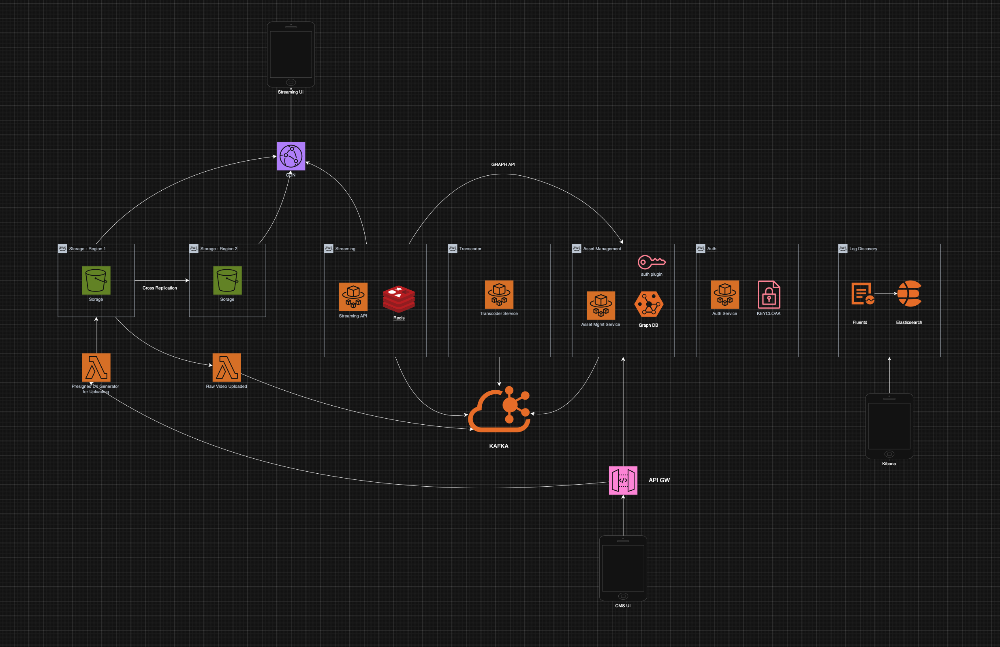

# Hobby Streamer

> A personal playground for video streaming ideas. Not production, just for fun and learning.

This project explores building a video streaming platform using modern software architecture patterns. It experiments with domain-driven design principles and event-driven microservices to create a video processing pipeline. The system handles video uploads, transcoding, and streaming delivery, with authentication, monitoring, and developer tooling to support the learning journey.

## Features
Video upload, transcoding (HLS/DASH), stream delivery, asset metadata, Keycloak-based auth, developer logging, monitoring, Docker Compose setup, Redis caching, Kafka event streaming, Lambda functions, circuit breakers, retries,health checks, rate limiting, local-first development.


## Architecture



Docs: [CDN Proposal](docs/cdn-proposal.md), [Kafka Architecture](docs/kafka-architecture.md)

## Tech Stack
Backend: Go, GraphQL, Neo4j, Keycloak, FFmpeg, Redis, Kafka, Docker Compose, LocalStack, Fluentd, Elasticsearch, Kibana, Nginx. Frontend: React Native (CMS, viewer UI). Lambdas: AWS Lambda with Go runtime.

## Services
Backend: [`asset-manager`](backend/asset-manager/README.md), [`auth-service`](backend/auth-service/README.md), [`transcoder`](backend/transcoder/README.md), [`streaming-api`](backend/streaming-api/README.md). Lambdas: [`raw_video_uploaded`](backend/lambdas/cmd/raw_video_uploaded/README.md), [`hls_job_requested`](backend/lambdas/cmd/hls_job_requested/README.md), [`generate_video_upload_url`](backend/lambdas/cmd/generate_video_upload_url/README.md), [`generate_image_upload_url`](backend/lambdas/cmd/generate_image_upload_url/README.md), [`delete_files`](backend/lambdas/cmd/delete_files/README.md). Frontend: [`HobbyStreamerCMS`](frontend/HobbyStreamerCMS/README.md), [`HobbyStreamerUI`](frontend/HobbyStreamerUI/README.md). Shared: see `backend/pkg` for common code.

## Getting Started

Requirements: Docker, Go 1.21+, FFmpeg, Python + pipx, Node.js 22+, `awscli-local` (`pipx install awscli-local && pipx ensurepath`).

Quick start:
```bash
./local/build.sh
```
Starts all services, UIs, dependencies, and logging pipeline.

Development:
```bash
cd backend
make install-tools
make lint && make test
./scripts/pre-commit.sh
make generate && make build
```

## Testing
Integration tests: [`integration-tests`](integration-tests/README.md) with Karate framework for API testing, data population, and end-to-end workflows.

## Observability
See [Logging Setup](local/LOGGING.md) for Fluentd → Elasticsearch → Kibana with structured logs and correlation IDs.