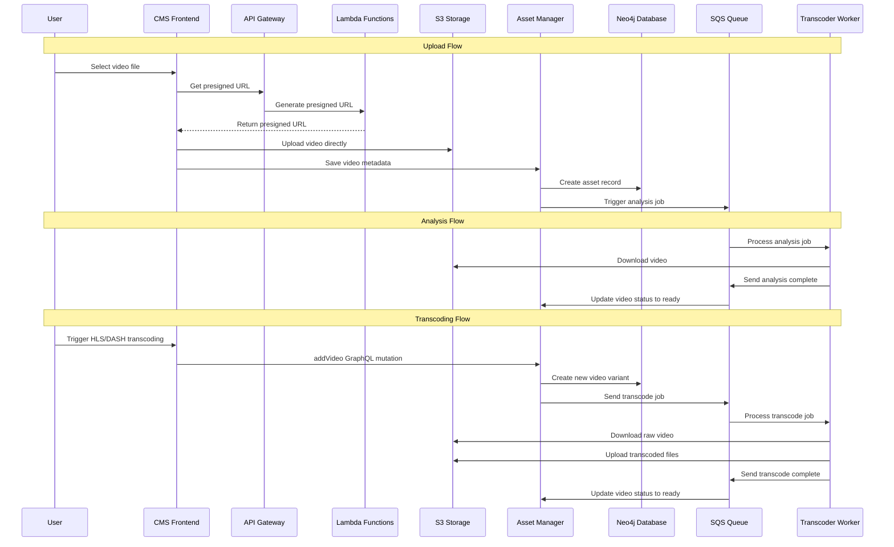

# Video Upload and Transcoding Sequence

A simplified overview of how video upload and transcoding works in the hobby-streamer project.

## Sequence Diagram



## Key Components

- **CMS Frontend**: React Native app for managing videos
- **Asset Manager**: GraphQL API for asset metadata and transcoding orchestration
- **Transcoder Worker**: Background video processing service with retry mechanism
- **Neo4j**: Database for asset relationships
- **S3**: File storage (raw, HLS, DASH buckets)
- **SQS**: Message queue for job coordination
- **Lambda**: Serverless functions for presigned URLs and file operations

## Storage Structure

```
S3 Buckets:
├── raw-storage/{assetId}/{videoId}/video.mp4
├── hls-storage/{assetId}/{videoId}/playlist.m3u8
└── dash-storage/{assetId}/{videoId}/manifest.mpd
```

## Video Model

```json
{
  "id": "video-123",
  "type": "MAIN",
  "format": "raw|hls|dash",
  "storageLocation": {
    "bucket": "raw-storage",
    "key": "asset-456/video-123/video.mp4"
  },
  "width": 1920,
  "height": 1080,
  "duration": 120.5,
  "status": "pending|analyzing|transcoding|ready|failed"
}
```

## Status Flow

1. **Upload**: Video uploaded → status: "ready"
2. **Transcode**: User triggers via GraphQL → new video record with status: "transcoding" → "ready"
3. **Multiple formats**: Same content can have raw, HLS, and DASH variants
4. **Retry mechanism**: Transcoder automatically retries failed jobs with exponential backoff
5. **Error handling**: Validation errors are immediately discarded, other errors trigger retries


