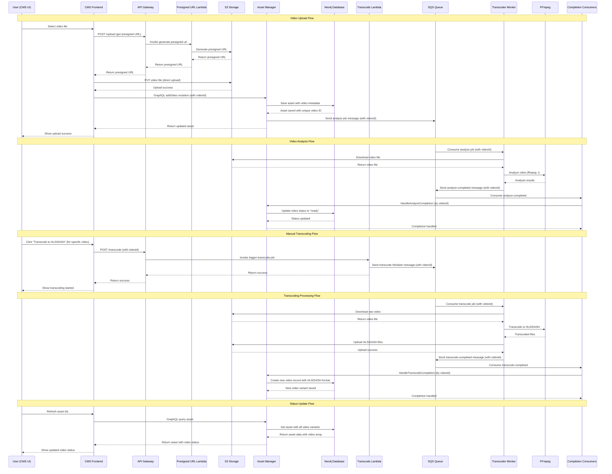

# Video Upload and Transcoding Sequence Diagram

This document provides a detailed UML sequence diagram showing the complete flow of video uploading and transcoding in the hobby-streamer project using the simplified video model.

## Sequence Diagram



## Key Components and Their Roles

### Frontend Components
- **CMS UI**: React Native application for managing assets

### Backend Services
- **Asset Manager**: GraphQL API for asset management and metadata
- **Transcoder Worker**: Background service for video processing
- **Neo4j**: Graph database for asset relationships and metadata

### AWS Services (LocalStack)
- **S3 Storage**: File storage with different buckets for raw, HLS, and DASH content
- **SQS**: Message queue for job coordination
- **Lambda Functions**: Serverless functions for presigned URLs and job triggering
- **API Gateway**: HTTP endpoints for Lambda functions

### Video Processing
- **FFmpeg**: Video analysis and transcoding engine
- **Video Variants**: Raw, HLS, and DASH formats with different storage locations

## Message Flow Details

### 1. Upload Flow
1. User selects video file in CMS
2. CMS requests presigned URL from Lambda via API Gateway
3. Lambda generates S3 presigned URL for direct upload
4. CMS uploads video directly to S3 using presigned URL
5. CMS calls Asset Manager to save video metadata (creates unique video ID)
6. Asset Manager automatically triggers analysis job with video ID

### 2. Analysis Flow
1. Transcoder worker consumes analyze job from SQS (with video ID)
2. Downloads video from S3 using video ID in path
3. Runs FFmpeg analysis to validate video
4. Sends completion message back to SQS with video ID
5. Asset Manager updates specific video status to "ready" by video ID

### 3. Transcoding Flow
1. User manually triggers HLS/DASH transcoding for specific video
2. Transcode Lambda sends job to SQS with video ID
3. Transcoder worker processes the job using video ID
4. Downloads raw video, transcodes with FFmpeg
5. Uploads transcoded files to appropriate S3 bucket using video ID
6. Sends completion message with new file locations and video ID
7. Asset Manager creates new video record with HLS/DASH format

## Storage Structure

```
S3 Buckets:
├── raw-storage/
│   └── {assetId}/
│       └── {videoId}/
│           └── {timestamp}_{filename}
├── hls-storage/
│   └── {assetId}/
│       └── {videoId}/
│           └── playlist.m3u8 + segments
└── dash-storage/
    └── {assetId}/
        └── {videoId}/
            └── manifest.mpd + segments
```


### Video Structure
Each video is represented as a flat object with a unique ID:

```json
{
  "id": "video-123",
  "type": "MAIN",
  "format": "raw",
  "storageLocation": {
    "bucket": "raw-storage",
    "key": "asset-456/video-123/sample.mp4",
    "url": "http://localhost:4566/raw-storage/asset-456/video-123/sample.mp4"
  },
  "width": 1920,
  "height": 1080,
  "duration": 120.5,
  "status": "ready",
  "createdAt": "2024-01-01T00:00:00Z",
  "updatedAt": "2024-01-01T00:00:00Z"
}
```

### Video Types and Formats
- **Types**: MAIN, TRAILER, BEHIND_THE_SCENES, INTERVIEW
- **Formats**: raw, hls, dash
- **Status**: pending, analyzing, transcoding, ready, failed

## Status Transitions

### Video Status Flow
```
pending → analyzing → ready (for raw videos)
pending → transcoding → ready (for HLS/DASH videos)
```

### Transcoding Flow
1. Raw video uploaded → status: "ready"
2. User triggers HLS/DASH transcoding → new video record created with status: "transcoding"
3. Transcoding completes → status: "ready"
4. Multiple format videos can exist for the same content (raw, hls, dash)


