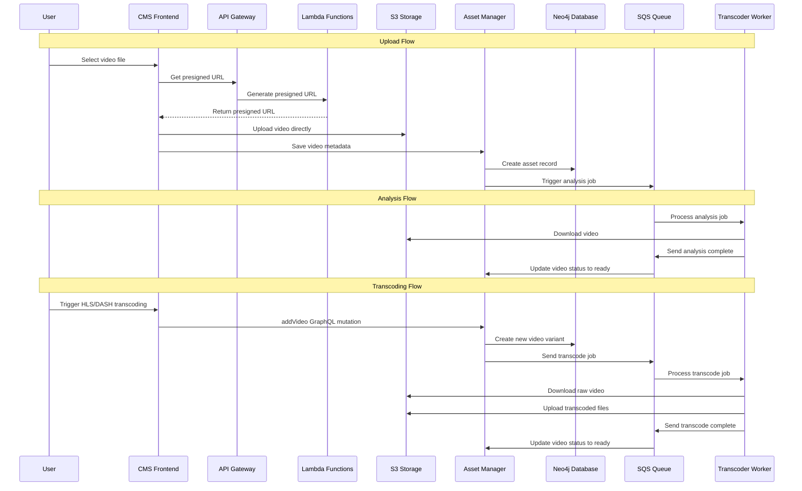

# Video Upload and Transcoding Sequence

How video upload and transcoding works in hobby-streamer.

## Sequence Diagram



## Storage Structure
S3: content-east/{assetId}/source/video.mp4, content-east/{assetId}/hls/1080p/playlist.m3u8, content-east/{assetId}/dash/1080p/manifest.mpd

## Video Model
```json
{
  "id": "video-123",
  "type": "MAIN",
  "format": "raw|hls|dash",
  "storageLocation": {
    "bucket": "content-east",
    "key": "asset-456/source/video.mp4"
  },
  "width": 1920,
  "height": 1080,
  "duration": 120.5,
  "status": "pending|analyzing|transcoding|ready|failed",
  "streamInfo": {
    "cdnPrefix": "http://localhost:8083/cdn",
    "url": "http://localhost:8083/cdn/asset-456/hls/1080p/playlist.m3u8"
  }
}
```

## Status Flow
1. Upload: status "ready"
2. Transcode: user triggers via GraphQL, new video record with status "transcoding" → "ready"
3. Multiple formats: raw, HLS, DASH variants
4. Retry: transcoder retries failed jobs
5. Error handling: validation errors discarded, others retried


