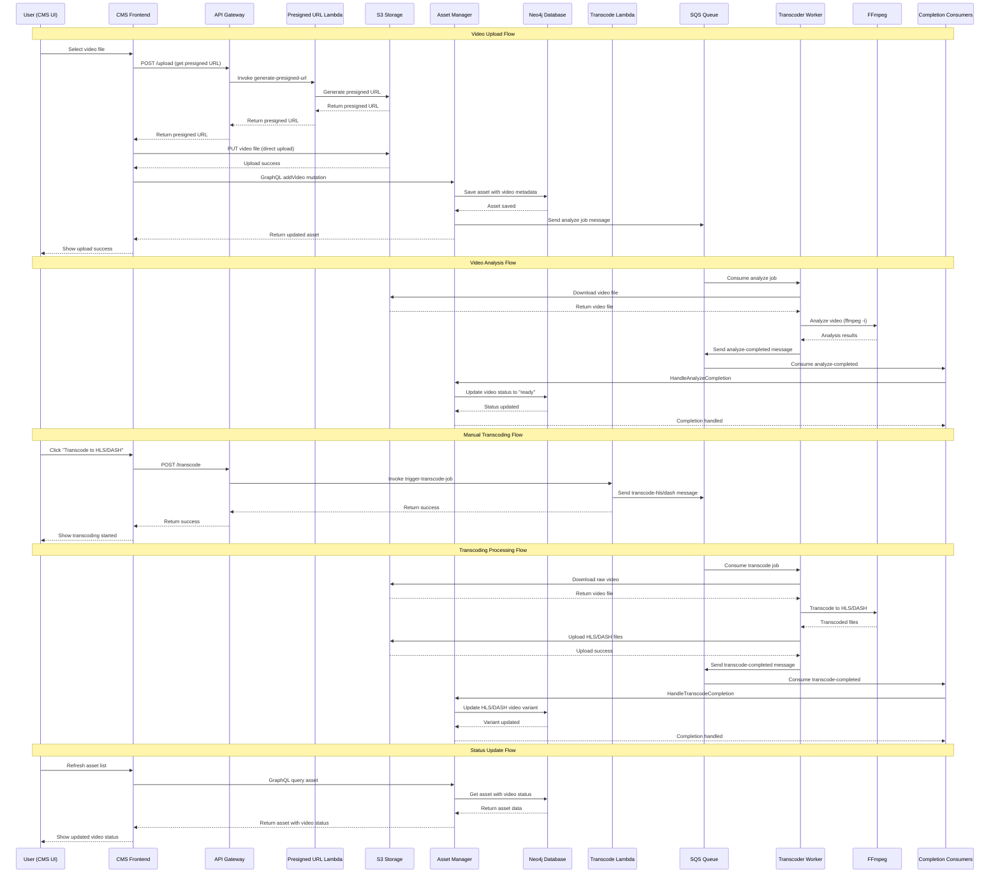

# Video Upload and Transcoding Sequence Diagram

This document provides a detailed UML sequence diagram showing the complete flow of video uploading and transcoding in the hobby-streamer project.

## Sequence Diagram



## Key Components and Their Roles

### Frontend Components
- **CMS UI**: React Native application for managing assets

### Backend Services
- **Asset Manager**: GraphQL API for asset management and metadata
- **Transcoder Worker**: Background service for video processing
- **Neo4j**: Graph database for asset relationships and metadata

### AWS Services (LocalStack)
- **S3 Storage**: File storage with different buckets for raw, HLS, and DASH content
- **SQS**: Message queue for job coordination
- **Lambda Functions**: Serverless functions for presigned URLs and job triggering
- **API Gateway**: HTTP endpoints for Lambda functions

### Video Processing
- **FFmpeg**: Video analysis and transcoding engine
- **Video Variants**: Raw, HLS, and DASH formats with different storage locations

## Message Flow Details

### 1. Upload Flow
1. User selects video file in CMS
2. CMS requests presigned URL from Lambda via API Gateway
3. Lambda generates S3 presigned URL for direct upload
4. CMS uploads video directly to S3 using presigned URL
5. CMS calls Asset Manager to save video metadata
6. Asset Manager automatically triggers analysis job

### 2. Analysis Flow
1. Transcoder worker consumes analyze job from SQS
2. Downloads video from S3
3. Runs FFmpeg analysis to validate video
4. Sends completion message back to SQS
5. Asset Manager updates video status to "ready"

### 3. Transcoding Flow
1. User manually triggers HLS/DASH transcoding
2. Transcode Lambda sends job to SQS
3. Transcoder worker processes the job
4. Downloads raw video, transcodes with FFmpeg
5. Uploads transcoded files to appropriate S3 bucket
6. Sends completion message with new file locations
7. Asset Manager updates video variants with transcoded content

## Storage Structure

```
S3 Buckets:
├── raw-storage/
│   └── {assetId}/
│       └── {videoType}/
│           └── {timestamp}_{filename}
├── hls-storage/
│   └── {assetId}/
│       └── {videoType}/
│           └── playlist.m3u8 + segments
└── dash-storage/
    └── {assetId}/
        └── {videoType}/
            └── manifest.mpd + segments
```

## Status Transitions

### Video Status Flow
```
pending → analyzing → ready (for raw videos)
pending → transcoding → ready (for HLS/DASH variants)
```


