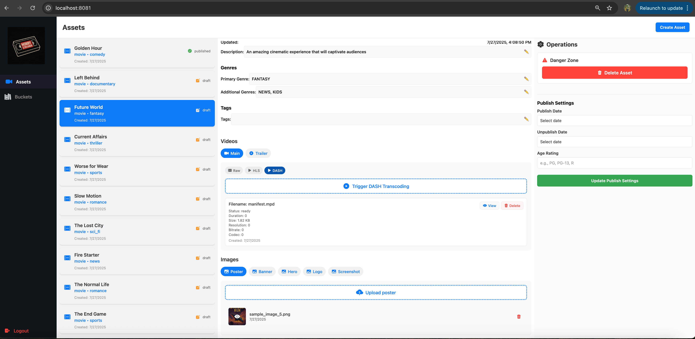
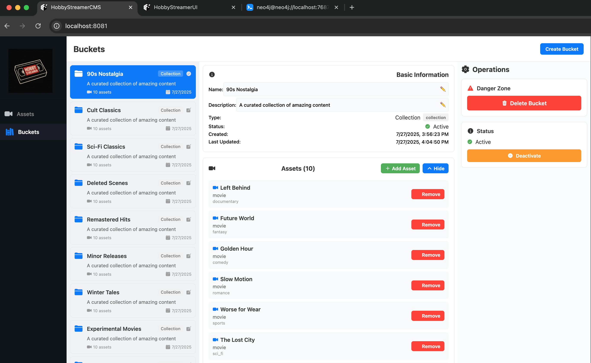
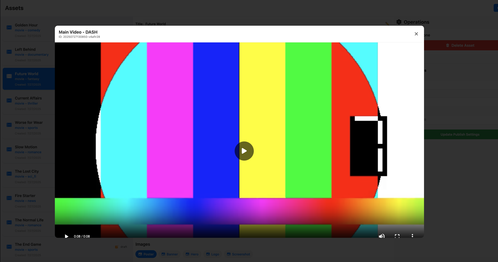

# Hobby Streamer CMS – React Native (Web)

Simple CMS frontend built with React Native (Expo) for asset management flows. Runs in browser via Expo for Web.

## Features

Paginated asset list, asset creation/edit forms, file uploads (presigned S3 URLs), Keycloak auth, React Navigation UI.

## Screenshots





## Prerequisites

Node.js v18+, npm/yarn, Expo CLI

## Getting Started

```bash
npm install
npm run web  # Opens http://localhost:8001
```

## Project Structure

```
src/
├── components/     # Shared UI pieces
├── screens/        # Page-level components
├── services/       # API calls and backend integration
├── types/          # TypeScript definitions
└── utils/          # Helpers and utilities
```

## Backend Integration

Connects to local services:
- **Asset Manager** – `http://localhost:8082`  
- **Auth Service** – `http://localhost:8080`

## Development

### Hot Reloading
```bash
npm run web       # Web with hot reload
npm run ios       # iOS simulator
npm run android   # Android emulator
```

**Auto-updates:** UI styling, component structure, props/state  
**Needs restart:** Native modules, expo.config.js, dependencies

### Manual Refresh
- Browser refresh (`F5` or `Cmd+R`)
- Terminal shortcut (`r` when Metro running)
- Mobile: shake device → "Reload"

### Adding Screens
1. Create file under `src/screens/`
2. Register in main navigator (`App.tsx`)
3. Update types if needed (`types/navigation.ts`)

### API Integration
All API logic in `src/services/api.ts`:
- `assetService`: upload, fetch, update, delete
- `authService`: login and token management

> ⚠️ Part of Hobby Streamer playground. Not production-ready, testing ground for UI/API patterns.